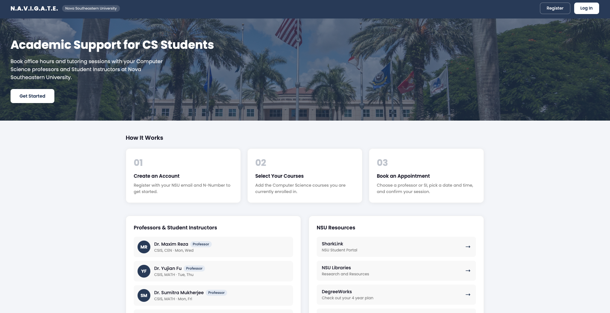

# N.A.V.I.G.A.T.E.
### Nova Southeastern University Academic Guidance and Tutoring Engine

A scheduling platform for CS students at Nova Southeastern University to book office hours and tutoring sessions with professors and Student Instructors.

> ⚠️ Portfolio project by [Arman Gasparyan](https://github.com/imarmang) — NSU CS Graduate 2026. **NOT an official NSU product.**

---



---

## Tech Stack

| Layer | Technology |
|---|---|
| Frontend | React |
| Backend | Python, Flask |
| Database | PostgreSQL (Neon) |
| Hosting | Vercel (frontend) · Render (backend) |

---

## Prerequisites

- Python 3.10+
- Node.js and npm
- PostgreSQL database (local or [Neon](https://neon.tech))

---

## Installation

### Backend

```bash
cd backend
python -m venv venv
source venv/bin/activate
pip install -r requirements.txt
```

Create a `.env` file:
```
DATABASE_URL=your_postgresql_connection_string
JWT_SECRET_KEY=your_secret_key
```

Initialize the database and run:
```bash
flask shell
>>> from app import db; db.create_all(); exit()
flask run
```

### Frontend

```bash
cd frontend
npm install
```

Create a `.env` file:
```
VITE_API_URL=http://localhost:5000
```

```bash
npm run dev
```